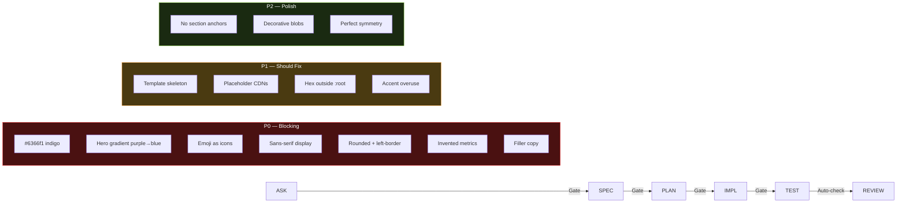
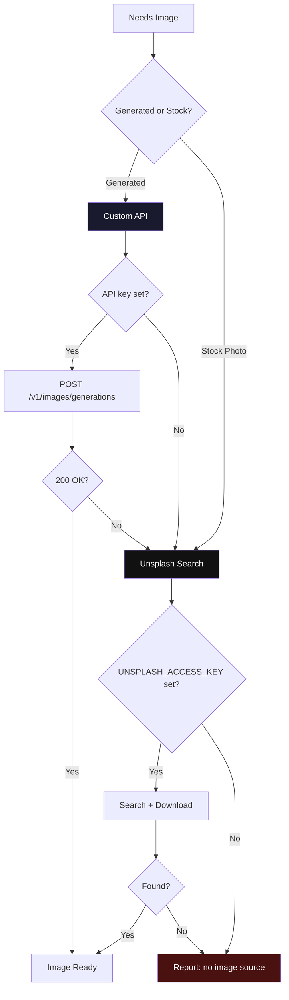

# UI/UX Methodology (uiux-meth)


> Anti-slop design intelligence + dev-methodology workflow for frontend UI.

Design and ship frontend interfaces that look intentional, not templated. Covers landing pages, ecommerce, dashboards, and marketing pages across all frontend stacks. Actively avoids "AI slop" (default Tailwind indigo, two-stop hero gradients, emoji icons, filler copy, fake metrics, rounded left-border cards).

Combines **5 design domains** into one unified workflow with **anti-slop quality gates** at every phase.

---

## Table of Contents

- [What It Is](#what-it-is)
- [Version](#version)
- [Obsidian Integration](#obsidian-integration)
- [Fable Design Loop](#fable-design-loop)
- [Install](#install)
- [Setup (API Keys)](#setup-api-keys)
- [21st.dev MCP Registry](#21stdev-mcp-registry)
- [Workflow](#workflow)
- [The Seven Cardinal Sins](#the-seven-cardinal-sins)
- [Scripts](#scripts)
- [Data Files](#data-files)
- [Design Dials](#design-dials)
- [Pre-Ship Checklist](#pre-ship-checklist)
- [License](#license)

---

## What It Is

| Capability | What It Does |
|---|---|
| **Design Intelligence** | BM25 search across 84 styles, 192 product types, 192 palettes, 74 font pairings, 99 UX rules |
| **Design System** | 3-layer token architecture (global → alias → component), auto-generate + validate |
| **Brand Identity** | Voice, messaging, visual language extraction from brand guidelines |
| **Banner Design** | Image generation with anti-slop prompts + Unsplash fallback |
| **Anti-Slop Validation** | 13 automated checks (P0/P1/P2) to catch AI-generated boilerplate |
| **Fable Evidence Loop** | verify by observation — render + lihat, bukan cuma script pass |
| **Live Component Registry** | 12,000+ React components via 21st.dev MCP (`search`/`generate`) |

---

## Version

Current: **3.1.1** (see `VERSION`)

- 3.1.1 — **Graphify gitignore rule**: commit-vs-ignore `graphify-out/` (commit graph.json/html/GRAPH_REPORT/manifest/cost/labels; ignore `cache/`, `.graphify_python`, `.graphify_root`); blok gitignore utk diterapkan di repo project
- 3.1.0 — **Graphify Integration** (new `references/graphify/`): knowledge graph codebase (extract/query/path/explain, offline `--code-only`) for redesign/refactor existing code; hasil → `knowledge/`; install & deploy per machine + AUTH prompt to user
- 3.0.1 — **Vault Hygiene** (`references/obsidian/README.md`): graph check `unresolved`/`orphans` + 7 aturan dari audit nyata; hook Phase 6 verifikasi health graph
- 3.0.0 — **Obsidian Integration Module** (`references/obsidian/*`): vault-native design knowledge (DESIGN.md, brand, decisions, evidence), 4 retention flows, dependency self-healing, frontmatter `version:` sync
- 2.3.0 — Loading state (skeleton UI) section
- 2.2.1 — README: optional deps + version history
- 2.2.0 — Communication rules (ADHD-friendly, berlaku semua phase)
- 2.1.0 — no-ai-slop hook Phase 6 (copy blok/headline/microcopy) + optional dependencies table
- 2.0.0 — Data expansion + new domains + auto-detection + 21st.dev MCP
  - Data: styles 49→84, palettes 40→192, ux 70→99, charts 25, landing 34, gsap tiered 16
  - New domains: `icons`, `ui-reasoning`, `app-interface`, `google-fonts`, `stacks/` (22 stacks)
  - Engine: synonym normalization, auto domain detection, `--stack` flag
  - `framer-motion-presets.csv` — 14 Framer Motion presets (React + vanilla code)
  - `scripts/test_search.py` — 56-check self-test
  - 21st.dev MCP integration (search/generate live components)

Untuk update di device lain: `git pull` + `cat VERSION` untuk konfirmasi parity. Agent: bandingkan `version:` frontmatter lokal dengan tag remote.

## Obsidian Integration

Modul `references/obsidian/*` = cara skill ini terhubung ke vault Obsidian: **mencatat, merangkum (defuddle), mengkoneksikan (wikilink/base/canvas), meretain** design knowledge lintas sesi & lintas mesin.

- Saat bekerja di dalam vault → `knowledge/DESIGN.md`, brand context, keputusan design, evidence BM25 & hasil anti-slop ditulis **vault-native** (frontmatter + wikilinks + tags) + update tracker/base/canvas sesuai phase.
- **Dependency self-healing** — kurang Obsidian / CLI / defuddle / node → tanya user → bantu deploy → verify. Detail: `references/obsidian/README.md`.
- Setup per mesin: `git pull` skill repo + `npm install -g defuddle` + enable Obsidian CLI (Settings → General → Advanced).
- Konten diadaptasi dari [kepano/obsidian-skills](https://github.com/kepano/obsidian-skills) (MIT).

## Optional Dependencies

Quality gate opsional — bukan bundel, referensi. Install di agent (bukan di repo ini) biar update upstream selalu nyampe:

| Skill | Sumber | Kapan dipakai | Install | Perlu tanya user? |
|---|---|---|---|---|
| `no-ai-slop` | petergyang/no-ai-slop | Phase 6: user-facing copy blok (headline/microcopy) | `npx skills add petergyang/no-ai-slop --skill no-ai-slop --yes` | ❌ gak perlu (cuma file rules) |
| `penetration-testing-with-strix` | usestrix/strix | Task nyentuh web/API/auth/input | `npx skills add usestrix/strix --skill penetration-testing-with-strix --yes` | ✅ WAJIB (butuh Docker + LLM API key) |

Kalau skill belum terinstall dan hook kepanggil: ikuti kebijakan (auto-install / tanya). Gak jadi jalan → catat `PENDING:` di report, jangan di-skip diam-diam.

---

## Fable Design Loop

Adapted from [fable-method](https://github.com/Sahir619/fable-method): verifikasi = **render, bukan cuma script**. Script anti-slop cek kode; mata ngecek hasil. Dua-duanya wajib.

```
ask ─► 0 classify ─► 1 define done ─► 2 evidence ─► 3 decide ─► 4 act ─► 5 verify ─► 6 report
```

| Step | Isi (versi design) | Hook ke phase |
|---|---|---|
| 0 classify | question/assessment ("review", "menurutmu") = findings doang, jangan ubah. Task ("buat", "redesign") = ubah + verify | Sebelum Phase 1 |
| 1 define done | observasi konkret: anti-slop strict pass, render bener di 375/768/1024/1440, konsisten sama `DESIGN.md` | Phase 1-2 |
| 2 evidence | buka `knowledge/DESIGN.md` + komponen existing + brand context DULU, baru desain. Jangan desain dari memory. BM25 search = evidence | Phase 2 |
| 3 decide | satu arah desain; alternatif disebut 1 baris kenapa kalah | Phase 3 |
| 4 act | INTENT gate versi design, smallest change | Phase 4 |
| 5 verify | **render + lihat sendiri**, bukan cuma anti-slop script pass | Phase 5 |
| 6 report | outcome-first + artifact gate | Phase 6 |

**Triviality gate:** satu file, <~10 baris, no visual/behavior baru, tau persis apa yang diubah → kerjakan + render 1 breakpoint + lapor 2 kalimat. Selain itu full loop.

**INTENT gate:** sebelum ubah visual: `INTENT: design does <X>; anti-slop check expects <Y>; brand guidelines say <Z>`. Wajib buka `knowledge/DESIGN.md` / brand guidelines buat slot Z. X/Y/Z gak cocok → jangan edit, itu temuannya. Authority order: user > brand guidelines > anti-slop check > design saat ini.

**Artifact gate:** `INTENT:` verbatim kalau visual berubah; `AUTH: user said "..."` kalau aksi outward (publish/deploy); `PENDING:` kalau follow-up di-skip. Twin check gak perlu terpisah — `anti-slop-check.py` scan seluruh project = twin check bawaan.

---

## Install

### Option A: Global (shared — all agents)

`~/.agents/skills/` adalah direktori shared. Semua agent (Pi, OpenClaw, dll) pakai path ini.

```bash
mkdir -p ~/.agents/skills
cp -r uiux-methodology ~/.agents/skills/
```

### Option B: Per-Project

Available only to a specific project.

```bash
# From your project root
mkdir -p .openclaw/skills
cp -r /path/to/uiux-methodology .openclaw/skills/

# Project structure:
my-project/
├── .openclaw/
│   └── skills/
│       └── uiux-methodology/
│           ├── SKILL.md
│           ├── scripts/
│           ├── data/
│           └── ...
├── .env                          # your API keys
└── src/
```

### Option C: Manual Copy

Copy files directly into your agent's skill folder.

```
~/.openclaw/workspace/skills/
└── uiux-methodology/
    ├── SKILL.md
    ├── .env.example
    ├── scripts/
    ├── data/
    ├── references/
    └── templates/
```

### Verify Installation

```bash
# Test BM25 search
python3 scripts/search.py "saas dark minimal" --design-system -p "Test"

# Test anti-slop checker
python3 scripts/anti-slop-check.py --help

# Test token generator
python3 scripts/generate-tokens.py --config tokens.json -o /tmp/test.css
```

---

## Setup (API Keys)

### Unsplash (Free)

Used as fallback image source when custom API is unavailable.

1. Go to [unsplash.com/developers](https://unsplash.com/developers)
2. Click **"Register as a developer"**
3. Log in or create an Unsplash account
4. Go to [unsplash.com/oauth/applications](https://unsplash.com/oauth/applications)
5. Click **"New Application"** — read and accept the terms
6. Name your application (e.g. `uiux-methodology`)
7. After creation, you'll see:
   - **Access Key** → this is your `UNSPLASH_ACCESS_KEY`
   - **Secret Key** → not needed for this skill
8. Copy the Access Key

> **Free tier:** 1,000 requests/hour, no credit card required.

### Custom Image API (Optional)

OpenAI-compatible image generation endpoint (`POST /v1/images/generations`). Supports any provider that implements this API format (OpenAI, Replicate, local models, etc.).

### Configure .env

```bash
# From skill directory
cp .env.example .env
```

Edit `.env`:

```env
# Unsplash (required for image fallback)
UNSPLASH_ACCESS_KEY=your-access-key-here

# Custom image API (optional — skip if not needed)
# MY_IMAGE_API_KEY=your-api-key
# MY_IMAGE_API_URL=https://your-provider.com/v1/images/generations
# MY_IMAGE_API_TIMEOUT=60
```

### .env Search Order

The scripts look for `.env` in this order (stops at first found):

| Priority | Location | Use Case |
|---|---|---|
| 1 | `SKILL_ENV_FILE` env var | Explicit override |
| 2 | Project root `.env` | Per-project keys (different projects, different keys) |
| 3 | Skill directory `.env` | Global fallback |

### Security

Add `.env` to `.gitignore`:

```gitignore
.env
```

---

## 21st.dev MCP Registry

Live registry of **12,000+ React components / themes / templates** (shadcn registry format). Components are copied into your repo (not installed as a dependency) — you own the code. Integrated via MCP so the search/generate tools are available to the agent directly.

### What Was Added

| Area | Detail |
|---|---|
| **MCP server** | `21st` registered in OpenClaw (`mcp.servers`) → HTTP `https://21st.dev/api/mcp` |
| **Tools** | 35 tools exposed via `bundle-mcp` — `search`, `generate`, `get_component`, `get_inspiration`, `search_logo`, `get_usage`, etc. |
| **Workflow hook** | design phase: `search` for inspiration → implement phase: `generate`/component install → anti-slop check still runs after |

### Getting an API Key

1. Go to [21st.dev/mcp](https://21st.dev/mcp)
2. Click **"Get an API key"** (browser login; free account)
3. Copy the key from your profile/dashboard

Free tier: catalog **search unlimited**, **2 component installs/day**. Paid: unlimited installs + AI credits for `generate`.

### Deploying the Key (local only)

**Never commit the key.** Store it in the OpenClaw environment file (outside the skill repo):

```bash
# 1. Add key to OpenClaw env (outside repo, chmod 600)
echo 'TWENTY_FIRST_API_KEY=21st_sk_xxxx' >> ~/.openclaw/.env
chmod 600 ~/.openclaw/.env

# 2. Register the MCP server — reference the env var, do NOT inline the key
openclaw mcp set 21st '{"url":"https://21st.dev/api/mcp","transport":"streamable-http","headers":{"x-api-key":"${TWENTY_FIRST_API_KEY}"}}'

# 3. Verify
openclaw mcp probe 21st   # expect: 35 tools
```

The `${TWENTY_FIRST_API_KEY}` is resolved from `~/.openclaw/.env` at runtime — the raw key never appears in `openclaw.json` or the repo. If you use a different env var name, update the reference accordingly.

> Tip: in CI or scripts, you can pass `--api-key $TWENTY_FIRST_API_KEY` to the 21st CLI instead of the env file.

### Notes

- Legacy Magic MCP (`@21st-dev/magic`) is deprecated; use the 21st CLI/server above.
- Sandboxed sessions: ensure `tools.sandbox.tools` allows `bundle-mcp` so the tools are visible.

---

## Workflow

The skill follows **dev-methodology** as its backbone, with **anti-slop quality gates** at every phase.

### Communication Rules (berlaku semua phase)

ADHD-friendly output — action first, tanpa basa-basi:

1. **Lead with the action** — apa yang berubah / yang harus dilakukan, baru konteks
2. **Numbered steps** — multi-step task / progress report → nomorin langkahnya
3. **End with one concrete next step** — tutup reply dengan langkah berikutnya + estimasi waktu (±menit)
4. **Restate state** — di debugging/review panjang, ulang state sekarang tiap turn
5. **Matter-of-fact errors** — kegagalan polos (`PENDING:` / error), tanpa pembelaan
6. **Suppress tangents** — info sampingan simpen di akhir, jangan di tengah
7. **No preamble, no recap, no closers** — langsung inti

### Overview

```mermaid
flowchart TD
    START([User Request]) --> TRIV{Trivial?<br/>1 file, <10 baris,<br/>no visual baru}
    TRIV -->|yes| DOIT["Kerjakan + render 1 breakpoint<br/>+ lapor 2 kalimat"]
    TRIV -->|no| ASK

    subgraph ASK["Phase 1: Ask — classify + define done"]
        README["Read knowledge/README.md
        (entry point — WAJIB)"] --> BD{Has knowledge/?}
        BD -->|Yes| CKNOW[Read knowledge/KNOWLEDGE.md]
        CKNOW --> CDS{Has knowledge/DESIGN.md?}
        BD -->|No| CREATE[Create knowledge/ folder
        from templates]
        CREATE --> CDS2{Has design system?}
        CDS -->|Yes| LOAD_DS[Load as design context]
        CDS -->|No| CDS2
        CDS2 -->|Yes| A3[Load existing tokens + brand]
        CDS2 -->|No| A4[Define from scratch]
        LOAD_DS --> A5[Extract: product type, audience, stack]
        A3 --> A5
        A4 --> A5
    end

    ASK --> SPEC

    subgraph SPEC["Phase 2: Spec — evidence dulu"]
        S1[Define scope: landing / ecommerce / dashboard] --> S2[Anti-slop spec]
        S2 --> S3[accent_token — NOT hardcoded indigo]
        S3 --> S4[font_display — serif or sans?]
        S4 --> S5[icon_set — Lucide / Heroicons / Radix / Tabler]
        S5 --> S6[anti_slop_profile — minimal / standard / strict]
        S6 --> S7[BM25 search for style inspiration]
    end

    SPEC --> PLAN

    subgraph PLAN["Phase 3: Plan — satu arah desain"]
        P1[Choose ONE bold visual move — the 20%] --> P2[Plan token architecture — 3-layer]
        P2 --> P3[Plan brand voice + microcopy]
        P3 --> P4[Generate knowledge/DESIGN.md
        using templates/knowledge-DESIGN.md]
        P4 --> P5[Generate knowledge/README.md
        using templates/knowledge-README.md]
        P5 --> P6[Anti-slop gate: What makes this NOT AI?]
    end

    PLAN --> IMPL

    subgraph IMPL["Phase 4: Implement — INTENT gate"]
        I1[generate-tokens.py → tokens.css] --> I2[inject-brand-context.py]
        I2 --> I3[Build components using tokens]
        I3 --> I4[generate.sh — images if needed]
    end

    IMPL --> TEST

    subgraph TEST["Phase 5: Test — verify by observation"]
        T1[anti-slop-check.py — P0/P1/P2] --> T2{P0 violations?}
        T2 -->|Yes| T3[Fix P0 sins first]
        T3 --> T1
        T2 -->|No| T4[validate-tokens.py]
        T4 --> T5["RENDER + lihat sendiri<br/>375 / 768 / 1024 / 1440"]
        T5 -->|visual broken| T1
    end

    TEST --> REVIEW

    subgraph REVIEW["Phase 6: Review — outcome-first"]
        R1[Final anti-slop audit] --> R2[80/20 balance check]
        R2 --> R3[Brand consistency against knowledge/DESIGN.md]
        R3 --> R4[Anti-slop writing: copy blok headline/microcopy → skill no-ai-slop (auto-install kalau belum ada)]
        R4 --> R5[Artifact gate: INTENT/AUTH/PENDING]
    end

    REVIEW --> KNOW

    subgraph KNOW["Phase 7: Knowledge"]
        K1[Log decisions to knowledge/KNOWLEDGE.md] --> K2[Update knowledge/DESIGN.md]
        K2 --> K3[Update knowledge/README.md if needed]
        K3 --> K4[Save anti-slop patterns + brand guidelines]
    end

    DONE2["\nknowledge/: README.md = entry\nKNOWLEDGE.md = context\nDESIGN.md = design spec"]
    KNOW --> DONE2 --> DONE

    KNOW --> DONE([Ship It])

    style ASK fill:#1a1a2e,stroke:#e0e0e0,color:#fff
    style SPEC fill:#1a1a2e,stroke:#e0e0e0,color:#fff
    style PLAN fill:#1a1a2e,stroke:#e0e0e0,color:#fff
    style IMPL fill:#1a1a2e,stroke:#e0e0e0,color:#fff
    style TEST fill:#2d1b4e,stroke:#e0e0e0,color:#fff
    style REVIEW fill:#1a1a2e,stroke:#e0e0e0,color:#fff
    style KNOW fill:#1a1a2e,stroke:#e0e0e0,color:#fff
```

### Anti-Slop Gates per Phase



### Image Generation Flow



---

## The Seven Cardinal Sins

P0 — must fix before shipping:

| # | Sin | Detection | Fix |
|---|-----|-----------|-----|
| 1 | Default Tailwind indigo (`#6366f1`) | `grep -rn '#6366f1\|#4f46e5\|#8b5cf6'` | Use `--accent` token |
| 2 | Two-stop hero gradient | `linear-gradient` with purple/blue/cyan | Flat surface + type |
| 3 | Emoji as feature icons | Emoji in h*, button, aria-label | SVG (Lucide/Heroicons) |
| 4 | Sans-serif on display headings | `font-family: Inter` on h1/h2 | `var(--font-display)` |
| 5 | Rounded card + left-border | `border-left` + `border-radius` | Drop one |
| 6 | Invented metrics | "10× faster", "99.9%" | Real data or placeholder |
| 7 | Filler copy | "lorem ipsum", "feature one" | Real microcopy |

---

## Scripts

### BM25 Design Search

```bash
python3 scripts/search.py "saas dark minimal" --design-system -p "MyApp"
python3 scripts/search.py "glassmorphism" --domain style
python3 scripts/search.py "dashboard" --domain chart --variance 3 --density 8
```

| Flag | Description |
|---|---|
| `--design-system` | Full design system output |
| `-p "Name"` | Project name |
| `--domain <type>` | Restrict: product, style, color, typography, ux, landing, chart, gsap, icons |
| `--variance 1-10` | Boldness: 1=minimal, 10=bold |
| `--motion 1-10` | Animation: 1=subtle, 10=complex |
| `--density 1-10` | Spacing: 1=spacious, 10=dense |
| `--persist` | Save to project root |
| `--output-dir` | Where to save |

### Anti-Slop Check

```bash
python3 scripts/anti-slop-check.py ./src
python3 scripts/anti-slop-check.py ./src --profile strict --format json
python3 scripts/anti-slop-check.py ./src --profile minimal
```

| Profile | Checks |
|---|---|
| `minimal` | P0 only (blocking) |
| `standard` | P0 + P1 (default) |
| `strict` | P0 + P1 + P2 |

Exit code: `0` = no P0, `1` = P0 found (fix first).

### Token Generator

Takes a nested JSON config and flattens it into `:root` CSS variables.

```bash
python3 scripts/generate-tokens.py --config tokens.json -o tokens.css
```

Example `tokens.json`:
```json
{
  "color": { "accent": "#1a1a2e", "bg": "#ffffff", "text": "#1e293b" },
  "font": { "display": "Playfair Display", "body": "Inter" },
  "radius": "8px"
}
```

### Token Validator

Scans a directory for hardcoded hex/rgb color values that should be tokens.

```bash
python3 scripts/validate-tokens.py --dir src/
# optional: --ext ".css,.scss,.tsx,.jsx,.vue,.svelte" (default)
```

### Brand Context Injector

Extracts brand context from `brand-guidelines.md` for prompt injection. Output goes to stdout; use `--json` for structured output.

```bash
python3 scripts/inject-brand-context.py --brand-file docs/brand-guidelines.md
python3 scripts/inject-brand-context.py --brand-file docs/brand-guidelines.md --json
```

### Image Generation

```bash
# Custom API
./scripts/generate.sh "Editorial photo of a minimalist desk setup, soft window light, no text" chatgpt-web 1 1024x1024 high png

# Parameters: PROMPT [model] [n] [size] [quality] [format]
```

| Param | Default | Options |
|---|---|---|
| `PROMPT` | *(required)* | Art-direction prose |
| `model` | `chatgpt-web` | Any model identifier |
| `n` | `1` | 1–10 |
| `size` | `auto` | `auto`, `1024x1024`, `1024x1536`, `1536x1024` |
| `quality` | `auto` | `auto`, `low`, `medium`, `high` |
| `format` | `png` | `png`, `jpg`, `jpeg`, `webp` |

---

## Data Files

| File | Records | Description |
|---|---|---|
| `product-types.csv` | 192 | Product type profiles (SaaS, ecommerce, fintech, etc.) |
| `ui-styles.csv` | 84 | UI style profiles (full specs, prompts, CSS keywords) |
| `color-palettes.csv` | 192 | Palettes with full token set (on-primary, card, muted, border, ring) |
| `font-pairings.csv` | 74 | Typography pairings (display + body) |
| `google-fonts.csv` | 1900+ | Google Fonts (popularity, variable axes, subsets, URLs) |
| `landing-patterns.csv` | 34 | Landing page structures + CTA strategy |
| `ux-guidelines.csv` | 99 | UX rules with do/don't + code examples |
| `ui-reasoning.csv` | 161 | Product-type decision rules (pattern, style, anti-patterns) |
| `app-interface.csv` | 30 | Mobile app guidelines (iOS/Android/RN) |
| `icons.csv` | 105 | Icon recommendations with import code (Phosphor/Lucide/Heroicons) |
| `chart-types.csv` | 25 | Chart recommendations (a11y notes, thresholds, libraries) |
| `gsap-presets.csv` | 16 | GSAP presets by intensity tier (subtle/standard/complex) |
| `framer-motion-presets.csv` | 14 | Framer Motion presets (React + vanilla code) |
| `stacks/` | 22 files | Stack guidelines (react, nextjs, vue, svelte, flutter, …) |

---

## Design Dials

Three 1-10 sliders to tune output:

| Dial | 1-3 | 4-7 | 8-10 |
|---|---|---|---|
| `--variance` | Centered/minimal | Balanced | Bold/asymmetric |
| `--motion` | Subtle micro-interactions | Standard scroll/stagger | Complex choreography |
| `--density` | Spacious (24-96px) | Standard (16-64px) | Dense/dashboard (8-32px) |

---

## Loading State (Skeleton UI)

Kalau UI nampilin data async (fetch, image, list) — wajib ada loading state:

- **Skeleton > spinner** — skeleton tunjukin struktur konten yang bakal muncul, layout match; spinner cuma bilang "tunggu"
- **Skeleton match layout aslinya** — card → card-shaped, list → baris-baris. Bukan kotak abstrak
- **Shimmer halus** — gradient sweep ±1.5-2s loop; `prefers-reduced-motion` → matiin shimmer, block statis aja
- **Jangan overshoot** — skeleton cuma buat initial load/pagination; refresh & filter cukup subtle
- **A11y** — `aria-busy="true"`; keep old data + subtle indicator pas refresh, jangan blank dulu
- **Verifikasi (Phase 5)** — throttle Slow 3G → skeleton muncul, gak ada layout jump pas data render

---

## Pre-Ship Checklist

```markdown
- [ ] cursor-pointer on all clickable elements
- [ ] Hover states with smooth transitions (150-300ms)
- [ ] Text contrast 4.5:1 minimum (WCAG AA)
- [ ] Focus states visible for keyboard navigation
- [ ] prefers-reduced-motion respected
- [ ] Responsive: 375px, 768px, 1024px, 1440px
- [ ] No hardcoded colors (all via design tokens)
- [ ] SVG icons only (no emoji as icons)
- [ ] Min touch target 44×44px
- [ ] Error messages near relevant fields
- [ ] No P0 cardinal sins present
- [ ] No P1 soft tells present
- [ ] Brand voice consistent across copy
- [ ] Accent token used, not hardcoded indigo
- [ ] Display font loaded and applied via tokens
- [ ] **Rendered + dilihat sendiri di 375/768/1024/1440** (bukan cuma script pass)
- [ ] **INTENT line ada kalau visual berubah** (artifact gate)
```

---

## Project Structure

```
uiux-methodology/
├── SKILL.md                              # Core skill doc + workflow
├── README.md                             # This file
├── LICENSE                               # MIT
├── .env.example                          # API key template
├── scripts/
│   ├── search.py                         # BM25 design search engine
│   ├── anti-slop-check.py                # Automated anti-slop validator
│   ├── generate.sh                       # Image generation (API + Unsplash)
│   ├── generate-tokens.py                # Design token generator
│   ├── validate-tokens.py                # Token validator
│   └── inject-brand-context.py           # Brand context extractor
├── data/
│   ├── product-types.csv
│   ├── ui-styles.csv
│   ├── color-palettes.csv
│   ├── font-pairings.csv
│   ├── landing-patterns.csv
│   ├── ux-guidelines.csv
│   ├── chart-types.csv
│   └── gsap-presets.csv
├── references/
│   ├── quick-reference.md
│   ├── pro-rules.md
│   ├── component-specs.md
│   ├── token-architecture.md
│   └── anti-slop-rules.md
└── templates/
    ├── DESIGN.md                        # Standalone DESIGN.md (root level, optional)
    ├── knowledge-README.md              # Entry point untuk folder knowledge/
    ├── knowledge-DESIGN.md              # Design system doc di dalam knowledge/
    ├── brand-guidelines-starter.md
    ├── design-tokens-starter.json
    └── anti-slop-checklist.md
```

---

## Priority Rules

0. Explicit user statement > brand guidelines > anti-slop check > design saat ini (INTENT authority order)
1. Anti-slop P0 sins override everything — always fix first
2. Brand guidelines override design search results
3. Existing project design system overrides skill recommendations
4. Token architecture enforces consistency
5. User preference overrides all defaults

---

## License

MIT License

Copyright (c) 2026 ardith666

Permission is hereby granted, free of charge, to any person obtaining a copy
of this software and associated documentation files (the "Software"), to deal
in the Software without restriction, including without limitation the rights
to use, copy, modify, merge, publish, distribute, sublicense, and/or sell
copies of the Software, and to permit persons to whom the Software is
furnished to do so, subject to the following conditions:

The above copyright notice and this permission notice shall be included in all
copies or substantial portions of the Software.

THE SOFTWARE IS PROVIDED "AS IS", WITHOUT WARRANTY OF ANY KIND, EXPRESS OR
IMPLIED, INCLUDING BUT NOT LIMITED TO THE WARRANTIES OF MERCHANTABILITY,
FITNESS FOR A PARTICULAR PURPOSE AND NONINFRINGEMENT. IN NO EVENT SHALL THE
AUTHORS OR COPYRIGHT HOLDERS BE LIABLE FOR ANY CLAIM, DAMAGES OR OTHER
LIABILITY, WHETHER IN AN ACTION OF CONTRACT, TORT OR OTHERWISE, ARISING FROM,
OUT OF OR IN CONNECTION WITH THE SOFTWARE OR THE USE OR OTHER DEALINGS IN THE
SOFTWARE.
